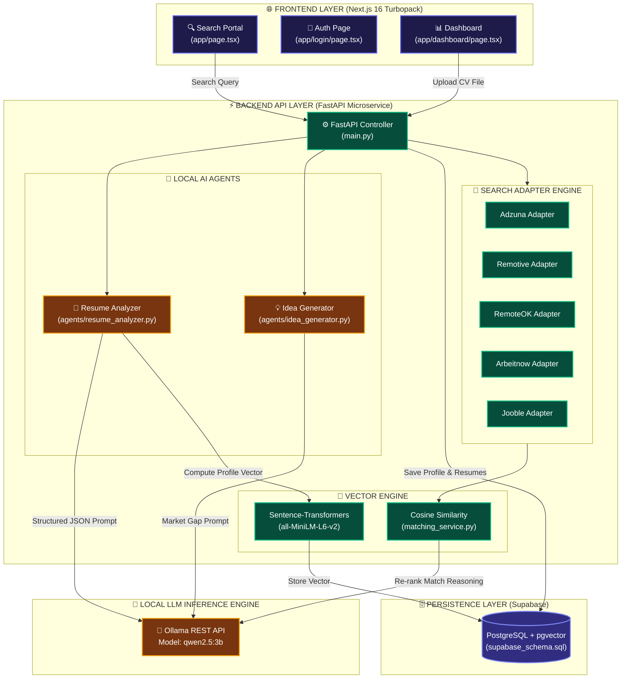

# 🎨 Trajectory — Architecture & Technical Execution Pipeline

[](https://python.org)
[](https://fastapi.tiangolo.com)
[](https://nextjs.org)
[](https://ollama.com)
[](https://supabase.com)
[](#-verification--test-suite)

> **Trajectory** orchestrates local AI model inference, sentence transformer vector embeddings, multi-adapter job market scrapers, and PostgreSQL database storage into a high-performance career intelligence platform.

---

## 📐 System Architecture Blueprint



---

## 🗺️ File-by-File Component Index

```
trajectory/
├── 📁 backend/
│   ├── 📄 main.py                      # FastAPI REST controllers & API routes
│   ├── 📄 requirements.txt             # Python dependencies
│   ├── 📁 agents/
│   │   ├── 📄 resume_analyzer.py       # Local Ollama CV parser & multi-domain audit agent
│   │   └── 📄 idea_generator.py        # Skill gap identifier & 4-phase project builder agent
│   ├── 📁 services/
│   │   ├── 📄 ollama_service.py        # Local Ollama REST client & JSON code-block parser
│   │   ├── 📄 matching_service.py      # Sentence-Transformer vector matcher & LLM re-ranker
│   │   └── 📄 resume_service.py        # PDF/DOCX document text extraction & Supabase storage
│   ├── 📁 adapters/
│   │   ├── 📄 adzuna.py                # Adzuna job market API adapter
│   │   ├── 📄 remotive.py              # Remotive remote jobs API adapter
│   │   ├── 📄 remoteok.py              # RemoteOK jobs API adapter
│   │   ├── 📄 arbeitnow.py             # Arbeitnow jobs API adapter
│   │   ├── 📄 jooble.py                # Jooble job search API adapter
│   │   └── 📄 utils.py                 # Query relevance, country filter, & dedup logic
│   └── 📁 tests/                       # Complete 37-test pytest suite
├── 📁 frontend/
│   ├── 📁 app/
│   │   ├── 📄 page.tsx                 # Search portal with Gig/Freelance mode & deep-links
│   │   ├── 📄 login.tsx                # Instant sign-in & email confirmation code OTP flow
│   │   └── 📄 dashboard/page.tsx       # Matched Jobs, Portfolio Ideas, & CV Audit UI
│   └── 📁 lib/
│       └── 📄 supabaseClient.ts        # Supabase browser auth & database client
├── 📄 project_info.md                  # Comprehensive user guide & setup documentation
├── 📄 project_pipeline.md              # Visual system architecture & pipeline breakdown
├── 📄 concepts.md                      # Complete AI & technical concept guide (Basic to Advanced)
└── 📄 README.md                        # Master repository documentation
```

---

## 🔄 End-to-End Execution Flow

> [!NOTE]
> **Stage 1: Document Upload & Parsing**  
> User uploads a resume file (`PDF` or `DOCX`). `services/resume_service.py` extracts raw text content using `pdfplumber` or `python-docx`.

> [!TIP]
> **Stage 2: Local AI Resume Audit**  
> `agents/resume_analyzer.py` sends the raw resume text to `services/ollama_service.py`, querying local model **`qwen2.5:3b`**. It extracts highest education, seniority, skills, tools, and a candidate pitch without cloud API fees.

> [!IMPORTANT]
> **Stage 3: Dense Vector Embedding & Matching**  
> `services/matching_service.py` encodes the candidate profile using `all-MiniLM-L6-v2` into a 384-dimensional vector. It computes Cosine Similarity against live job descriptions, re-ranking the top matches with local Ollama match reasoning.

> [!TIP]
> **Stage 4: Market-Driven Project Blueprinting**  
> `agents/idea_generator.py` queries live job search adapters for active candidate roles, identifies genuine missing skills, and constructs a 4-phase technical project architecture blueprint.

---

## 🧪 Verification & Test Suite

The backend contains a 37-test automated test suite covering all services, agents, adapters, and search filters:

```bash
cd backend
.venv/bin/python -m pytest tests/
```

```
======================== 37 passed in 5.77s ========================
```
