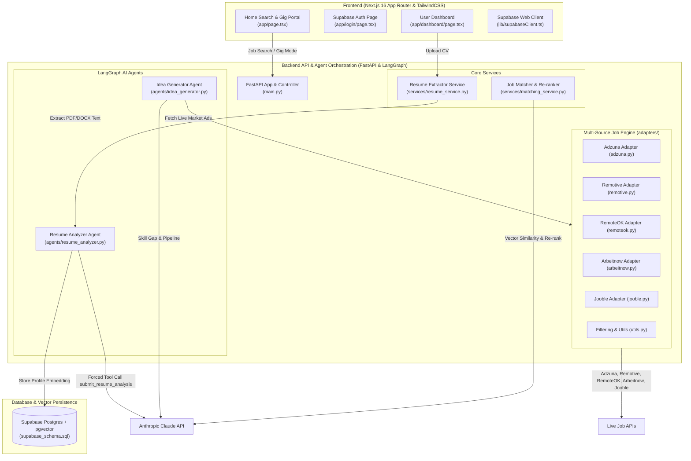

# Trajectory — Full Project Architecture & Execution Pipeline

**Trajectory** is an AI-powered Career Intelligence & Job Matching Platform built with Next.js 16 Turbopack on the frontend, FastAPI and LangGraph agents on the backend, Supabase pgvector for database security & vector embeddings, and a multi-adapter job search engine querying live market job APIs.

---

## High-Level System Architecture Diagram

---

## Component-by-Component Pipeline Breakdown

### 1. Frontend Web Application ([frontend/](file:///Users/m1pro/Projects/trajectory/frontend))
Built using **Next.js 16 (Turbopack App Router)**, **TypeScript**, **TailwindCSS**, and **Shadcn/UI**.

- **[app/page.tsx](file:///Users/m1pro/Projects/trajectory/frontend/app/page.tsx)**
  - Primary landing and search portal.
  - Multi-provider search input (query, country, city, work mode).
  - **Gig / Freelance Mode**: Hides country dropdown (freelance is borderless) and surfaces direct deep-links to Upwork, Fiverr, Freelancer, Toptal, and Rozee.pk.

- **[app/login/page.tsx](file:///Users/m1pro/Projects/trajectory/frontend/app/login/page.tsx)**
  - Authentication page supporting Email/Password and Google OAuth via Supabase Auth.

- **[app/dashboard/page.tsx](file:///Users/m1pro/Projects/trajectory/frontend/app/dashboard/page.tsx)**
  - Core user dashboard featuring 3 interactive tabs:
    1. **Matched Jobs Tab**: Displays personalized AI-matched jobs with % match scores, source site 2-3 sentence job description snippets, and natural language match reasoning.
    2. **Portfolio Ideas Tab**: Displays live market skill gaps and interactive **"Start Project &rarr;"** architecture pipeline modals.
    3. **My CV Tab**: Executive resume audit displaying highest education degree, seniority badge, summary pitch, core strengths, and resume enhancement recommendations.

- **[lib/supabaseClient.ts](file:///Users/m1pro/Projects/trajectory/frontend/lib/supabaseClient.ts)**
  - Configures the `@supabase/supabase-js` browser client connecting to Supabase Auth and database tables.

- **[components/ui/](file:///Users/m1pro/Projects/trajectory/frontend/components/ui)**
  - Reusable UI component primitives: `button.tsx`, `card.tsx`, `input.tsx`, `badge.tsx`, `tabs.tsx`, `select.tsx`.

---

### 2. Backend API & Ingestion Layer ([backend/](file:///Users/m1pro/Projects/trajectory/backend))
Built with **FastAPI**, **LangGraph**, **Pydantic**, and **HTTPX**.

- **[main.py](file:///Users/m1pro/Projects/trajectory/backend/main.py)**
  - Primary API server entry point configuring CORS, route controllers, and memory caches (`RESUME_CACHE`, `ANALYSIS_CACHE`).
  - Key REST Endpoints:
    - `GET /health` &mdash; Service health check.
    - `GET /jobs/search` &mdash; Concurrent multi-adapter search engine query.
    - `POST /resume/upload` &mdash; Multi-part PDF/DOCX file upload endpoint.
    - `POST /resume/analyze` &mdash; Triggers LangGraph Resume Analyzer agent.
    - `GET /jobs/matched` &mdash; Matches candidate profile vector against candidate jobs.
    - `POST /ideas/generate` &mdash; Triggers LangGraph Idea Generator agent.

- **[services/resume_service.py](file:///Users/m1pro/Projects/trajectory/backend/services/resume_service.py)**
  - Extracts raw text content from uploaded files:
    - `pdfplumber` for PDF parsing.
    - `python-docx` for DOCX parsing.

---

### 3. LangGraph AI Agent Orchestration ([backend/agents/](file:///Users/m1pro/Projects/trajectory/backend/agents))

- **[agents/resume_analyzer.py](file:///Users/m1pro/Projects/trajectory/backend/agents/resume_analyzer.py)**
  - State Graph workflow: `extract_skills` &rarr; `infer_role` &rarr; `embed_profile`.
  - **Structured LLM Forced Tool Call**: Uses Anthropic's forced tool choice (`submit_resume_analysis`) to guarantee field-correct JSON output without regex code-fence parsing.
  - **Work Experience & Multi-Domain Engine**: Evaluates Work Experience section duties, past job titles, degree background (`highest_education`), and skills across Electrical, Mechanical, Biomedical, Civil, Chemical, Data Science, and Software engineering fields.
  - **Vector Embeddings**: Computes 384-dim semantic embedding vectors and stores them in Supabase `profile_embeddings`.

- **[agents/idea_generator.py](file:///Users/m1pro/Projects/trajectory/backend/agents/idea_generator.py)**
  - State Graph workflow: `fetch_market_node` &rarr; `identify_skill_gaps` &rarr; `generate_project_ideas`.
  - **Live Job Market Collector (`fetch_market_node`)**: Concurrently queries job search engines for the candidate's target roles to pull active live job postings.
  - **AI Skill Gap Analysis**: Compares candidate's CV against live active job ads to identify missing competencies.
  - **4-Phase Architecture Pipeline Generator**: Produces 4-phase step-by-step technical blueprints, key features, and file tree structures.

---

### 4. Vector Matching & Search Adapters ([backend/services/](file:///Users/m1pro/Projects/trajectory/backend/services) & [backend/adapters/](file:///Users/m1pro/Projects/trajectory/backend/adapters))

- **[services/matching_service.py](file:///Users/m1pro/Projects/trajectory/backend/services/matching_service.py)**
  - **Vector Cosine Matcher**: Computes vector similarity between candidate profile vector and candidate job descriptions.
  - **Claude LLM Re-ranker**: Re-ranks top 20 candidate jobs using Claude, producing personalized match scores and natural language reasoning (e.g. *"Directly aligns with your Bachelor of Science in Mechanical Engineering background and SolidWorks CAD expertise."*).

- **Multi-Source Job Search Engine Adapters**:
  - **[adapters/adzuna.py](file:///Users/m1pro/Projects/trajectory/backend/adapters/adzuna.py)** &mdash; Adzuna REST API adapter.
  - **[adapters/remotive.py](file:///Users/m1pro/Projects/trajectory/backend/adapters/remotive.py)** &mdash; Remotive remote jobs API adapter.
  - **[adapters/remoteok.py](file:///Users/m1pro/Projects/trajectory/backend/adapters/remoteok.py)** &mdash; RemoteOK jobs API adapter.
  - **[adapters/arbeitnow.py](file:///Users/m1pro/Projects/trajectory/backend/adapters/arbeitnow.py)** &mdash; Arbeitnow job board API adapter.
  - **[adapters/jooble.py](file:///Users/m1pro/Projects/trajectory/backend/adapters/jooble.py)** &mdash; Jooble REST API adapter.
  - **[adapters/utils.py](file:///Users/m1pro/Projects/trajectory/backend/adapters/utils.py)** &mdash; Deduplication (`deduplicate_jobs`), strict query token matching (`is_query_relevant`), country keyword mapping (`is_country_relevant`), and HTML text cleaning (`clean_text`).

---

### 5. Database & Security Layer ([backend/supabase_schema.sql](file:///Users/m1pro/Projects/trajectory/backend/supabase_schema.sql))
Defines the PostgreSQL schema and Row-Level Security (RLS) policies:
- `resumes` table &mdash; User uploaded CV metadata and storage paths.
- `saved_searches` table &mdash; Saved search history.
- `profile_embeddings` table &mdash; Stores `vector(384)` embeddings with HNSW indexing for similarity search.

---

### 6. Deployment & CI/CD Pipeline
- **[frontend/vercel.json](file:///Users/m1pro/Projects/trajectory/frontend/vercel.json)** &mdash; Vercel deployment configuration for Next.js app.
- **[backend/railway.json](file:///Users/m1pro/Projects/trajectory/backend/railway.json)** & **[backend/render.yaml](file:///Users/m1pro/Projects/trajectory/backend/render.yaml)** &mdash; Deployment manifests for FastAPI backend.
- **[.github/workflows/ci.yml](file:///Users/m1pro/Projects/trajectory/.github/workflows/ci.yml)** &mdash; GitHub Actions automated workflow running `pytest` test suite and `next build` on every push to `main`.

---

### 7. Automated Test Suite ([backend/tests/](file:///Users/m1pro/Projects/trajectory/backend/tests))
- **[test_resume_analyzer.py](file:///Users/m1pro/Projects/trajectory/backend/tests/test_resume_analyzer.py)** &mdash; Unit tests for multi-domain CV extraction (Electrical, Mechanical, Biomedical, Civil, Software) and tool_use blocks.
- **[test_idea_generator.py](file:///Users/m1pro/Projects/trajectory/backend/tests/test_idea_generator.py)** &mdash; Unit tests for live job market idea generator and skill gap graph.
- **[test_job_matching.py](file:///Users/m1pro/Projects/trajectory/backend/tests/test_job_matching.py)** &mdash; Unit tests for cosine vector similarity and Claude re-ranking.
- **[test_all_adapters.py](file:///Users/m1pro/Projects/trajectory/backend/tests/test_all_adapters.py)** & **[test_adzuna.py](file:///Users/m1pro/Projects/trajectory/backend/tests/test_adzuna.py)** &mdash; Unit tests for job search engine adapters.
- **[test_resume_upload.py](file:///Users/m1pro/Projects/trajectory/backend/tests/test_resume_upload.py)** &mdash; Unit tests for PDF/DOCX file upload handlers.
